import { Head, Notes } from "mdx-deck";
import { Styled } from "styled-components";

export { default as theme } from "./theme.js";

import { CodeSurfer } from "mdx-deck-code-surfer";
import shadesOfPurple from "prism-react-renderer/themes/shadesOfPurple";

import {
	acfJSON,
	blockJSON,
	ConvertContent,
	DisableGutenberg,
	HeroTwig,
	RegisterHero,
	RestAction,
	RestPosts,
	LoadPlugin,
	PluginWordPress,
	PluginWordPressGenerate,
	QueryGraphQL,
	Hero,
	Page,
	Parser
} from "./components/Snippets.js";

import Avatar from "./components/Avatar.js";
import FullImage from "./components/FullImage.js";
import Video from "./components/Video.js";

<Head>
	<title>WordPress to Gatsby</title>
</Head>

<FullImage src="assets/images/intro.jpg" />

---

<Avatar src="assets/images/me.jpg" height="400px" width="400px" />

## Jack Pritchard

### Freelance Fullstack Website Developer

---

## Shameless Plug

### Taking on projects for Autumn 2019

I focus on front-end applications and have experience with -

- React
- NextJS
- Gatsby
- WordPress
- Timber

---

## WordPress to Gatsby

In this presentation I hope to show you the power of Gatsby, before creating a bridge between dependable development tools, processes and frameworks like WordPress.

---

## Before We Get Started!

### The Final Product

---

<iframe src="https://whatjackhasmade.co.uk" height="800px" width="1600px" />

---

## Gatsby

"Gatsby is a free and open source framework based on React that helps developers build blazing fast websites and apps"

---

<Video src="assets/videos/gatsby.mp4" />

---

## Modern web tech without the headache

Enjoy the power of the latest web technologies – React.js , Webpack , modern JavaScript and CSS and more — all set up and waiting for you to start building.

---

## Bring your own data

Gatsby’s rich data plugin ecosystem lets you build sites with the data you want — from one or many sources: Pull data from headless CMSs, SaaS services, APIs, databases, your file system, and more directly into your pages using GraphQL .

---

## Scale to the entire internet

Forget complicated deploys with databases and servers and their expensive, time-consuming setup costs, maintenance, and scaling fears. Gatsby.js builds your site as “static” files which can be deployed easily on dozens of services.

---

## Future-proof your website

Do not build a website with last decade’s tech. The future of the web is mobile, JavaScript and APIs—the JAMstack. Every website is a web app and every web app is a website.

---

## Speed past the competition

Instead of waiting to generate pages when requested, pre-build pages and lift them into a global cloud of servers — ready to be delivered instantly to your users.

---

## My Favourite Benefits of Gatsby

- Hot reloading
- Enables an offline first approach
- No need for heavy queries
- No need for server queries
- Console warnings as you develop, to encourage best practices
- Incredibly quick products

---

## Traditional server vs Gatsby (JAM)


---

## Gatsby Showcase

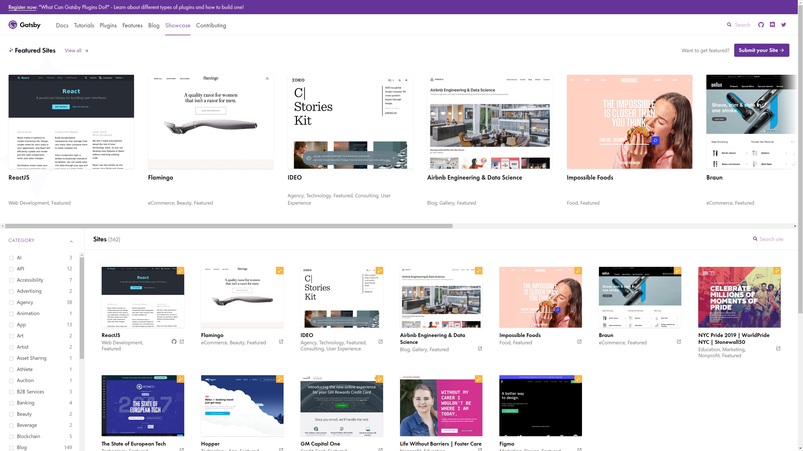

---

## Gatsby Plugins

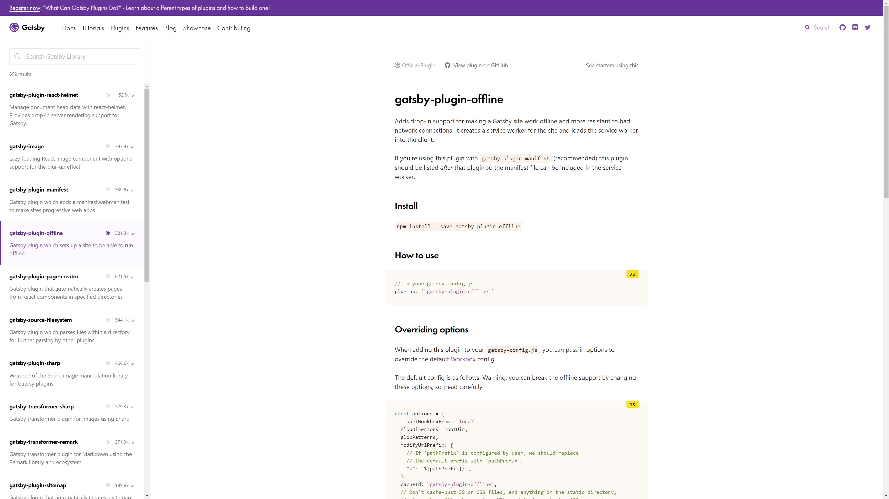

---

## Sold Yet?

(Gatsby I'll happily take any sponsorship at this point)

---

# Let's Build a Site 🔨

---

# Our Backend 🍑

---

<FullImage src="assets/images/full-wordpress.png" />

---

## WordPress

I assume many of you in the room know what WordPress is.

However, for those who need a recap, WordPress is an open source CMS (Content Management System).

<Notes>
	Some crazy figure like WordPress runs 32% of the entire internet is often
	thrown around.
</Notes>

---

## Gutenberg

For anyone using WordPress, I assume you know what Gutenberg is; For better or for worse.

Gutenberg is now the default content editor for WordPress.

---

## WordPress - Gutenberg


---

<FullImage src="assets/images/full-headless.png" />

---

## Headless WordPress

WordPress setups often involve a theme which provides front-end and back-end files to render webpages.

Instead, we are going to be creating custom API endpoints in our WordPress theme and importing that data to Gatsby to render pages.

Essentially using WordPress as only a backend.

<Notes>
	I want to make this clear distinction that whilst WordPress is great for a
	large portion of general client sites and handling of data. We are not going
	to be solely relying on traditional PHP or Twig files to generate our pages.
</Notes>

---

## Headless WordPress Endpoint

What we have in all WordPress setups (as of release 4.7.0+) - [https://wjhm.noface.app/wp-json/wp/v2/posts/](https://wjhm.noface.app/wp-json/wp/v2/posts/)

<Notes>

But what the heck is all of this?

These are REST API endpoints which allow for Create, Read, Update and Delete (CRUD) functions to your WordPress setup.

It opens doors as front-end frameworks are exploding in popularity.

You can now adopt WordPress to work fairly seamlessly with any of your preferred development workflows.

</Notes>

---

<FullImage src="assets/images/banner-acf.png" />

---

## Advanced Custom Fields (ACF)

ACF is a must have for any WordPress developer looking to improve their themes.

ACF allows developers to add custom fields (who'd have thought?) to posts and pages on a WordPress site.

<Notes>
	Not only this but as of ACF 5.8.0 you can now define and attach custom fields
	to Gutenberg blocks using ACF.
</Notes>

---

## Advanced Custom Fields (ACF)

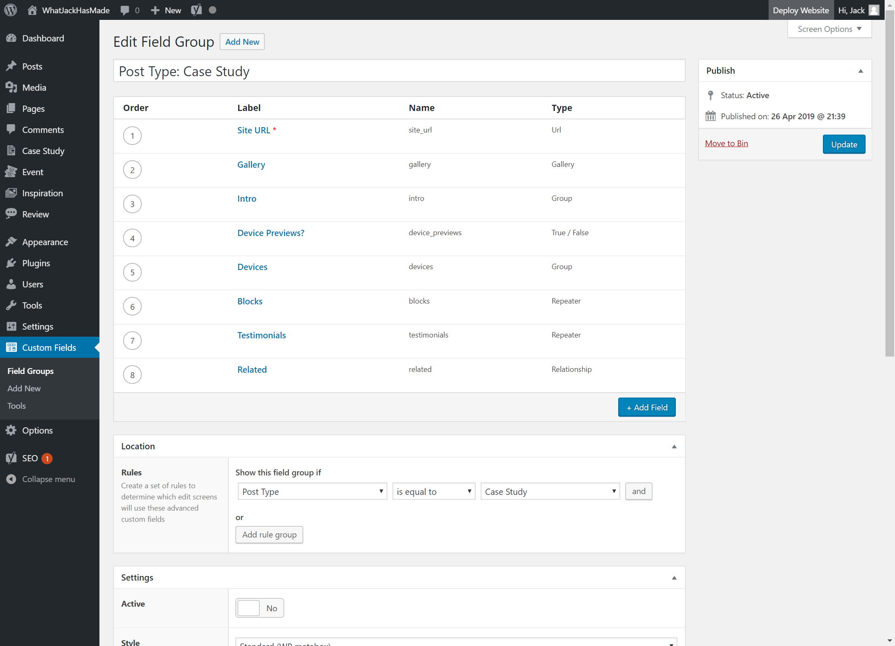

---

## That's All of Our Backend Tech Stack 👍

---

## Details to Follow

I know we've covered a few different technologies, but this talk is a step by step process.

So I will be going in to some more detail shortly.

<Notes>
	if you have any questions throughout the talk, I'll be taking a 2-minute break
	to answer questions on the backend and then a couple of minutes in the end to
	discuss the complete walkthrough.
</Notes>

---

## Setting a Task

I had set myself a task, to rebuild my personal website https://whatjackhasmade.co.uk 🔌

---

## Designs

I'm a big fan of atomic design, for anyone unfamiliar, atomic design is a concept of looking at pages and slicing them into smaller and smaller components.

<Notes>
	Brad Frost is the dad of Atomic Design so I highly recommend checking out his
	material if you want to learn more.
</Notes>

---

## Homepage

---

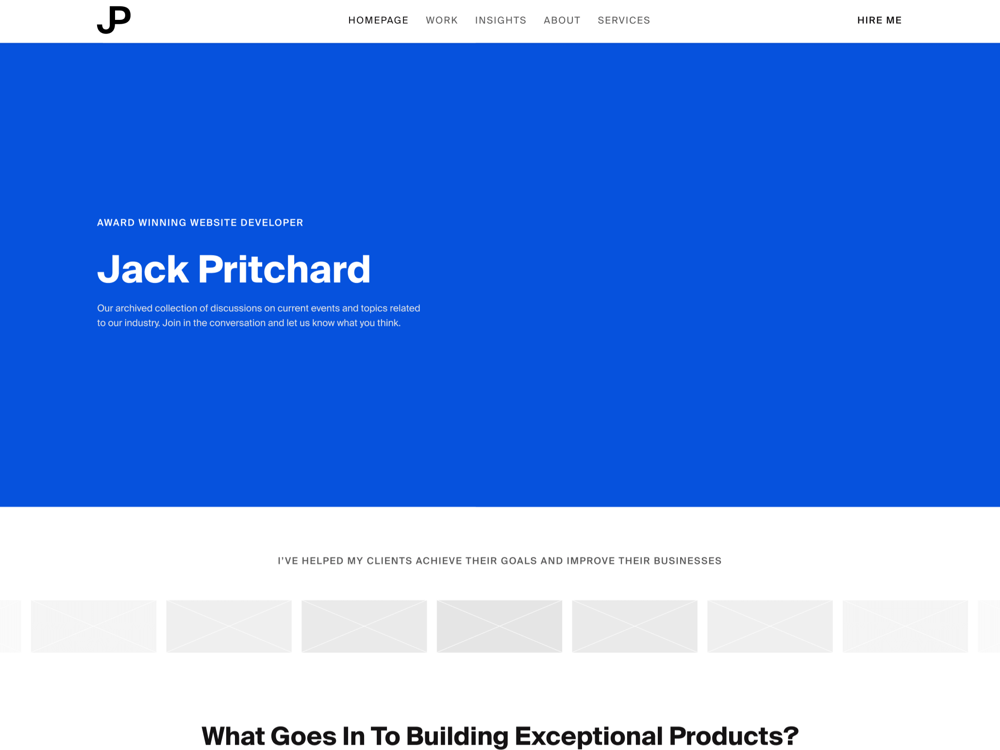

---

## Homepage - Disected

---

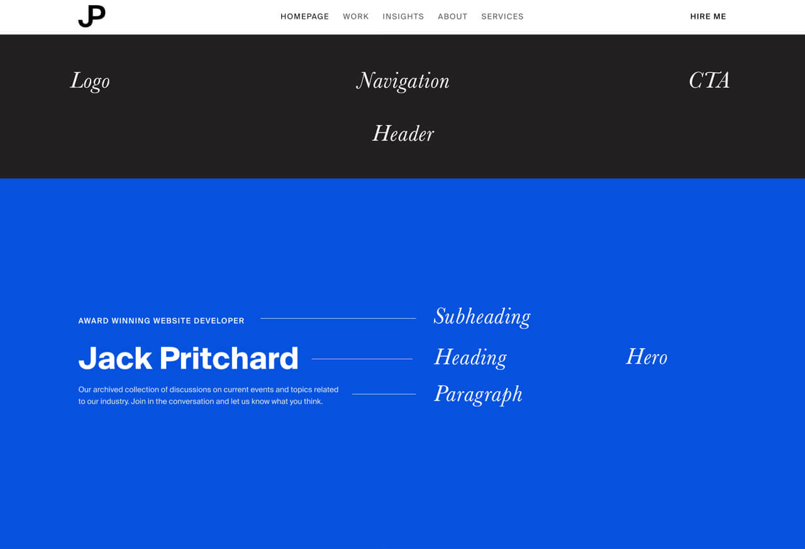

---

## We'll Only Be Focussing on The Hero

---


---

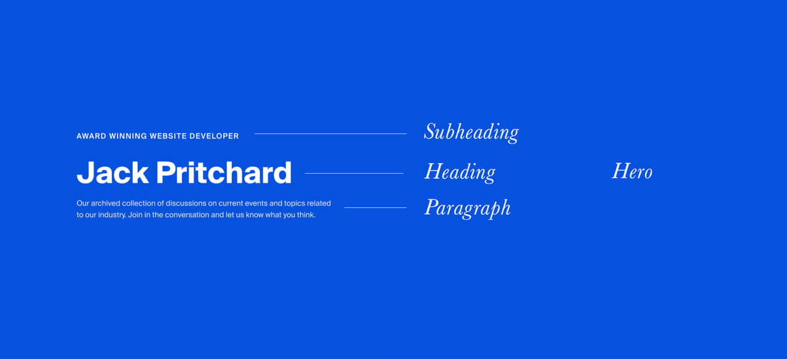

---

## Development Time

So we've got our designs, now time to start Developing

---

## WordPress

All we need to know is that we are running version 5 or above.

My WordPress environment is hosted at [https://wjhm.noface.app](https://wjhm.noface.app) on a shared hosting platform with PHP available.

---

## WordPress Plugins - Minimum Requirements

The only plugin we need to follow this process is ACF 5.8.0

---

## WordPress Theme

To kickstart the WordPress theme, I've downloaded and installed the Timber Starter Theme.

Feel free to download my theme repository as a starting point and alter as you need to - [https://github.com/whatjackhasmade/WJHM-Wordpress-Theme](https://github.com/whatjackhasmade/WJHM-Wordpress-Theme)

<Notes>
	I've made a few alterations to the code but we'll dive into that in a moment.
</Notes>

---

## WordPress Theme Structure

---

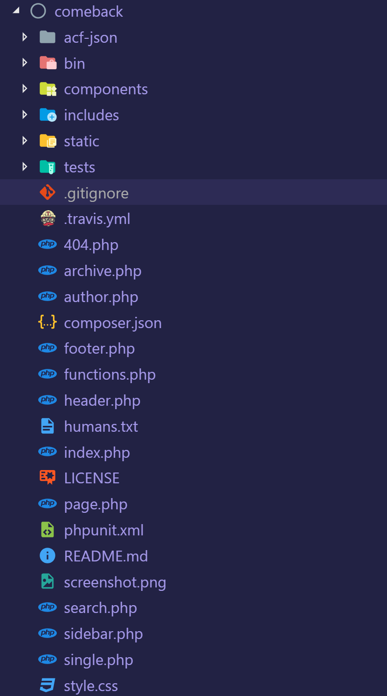

<Notes>
So far the setup is pretty standard, if you are unfamiliar with Timber, then you should in theory be able to do this without Timber.

The only alterations you will need to make is in how we register our Gutenberg blocks in a few slides.

</Notes>

---

## Removing Front-End Theme Files

To keep focus on a Headless WordPress build, I have for this project scraped all twig file templates and their components.

---

## WordPress Posts and Pages - WP Admin

With a fresh theme and environment, I then pulled in my local machines database full of posts and pages from my previous site.

---


---

## This is what we're left with

<iframe src="https://wjhm.noface.app" height="500px" width="1000px" />

---

<FullImage src="assets/images/full-angry.png" />

---

## Headless WordPress Endpoint

Besides an angry project manager that expected something to look at, we have our API endpoints - [https://wjhm.noface.app/wp-json/wp/v2/posts/](https://wjhm.noface.app/wp-json/wp/v2/posts/)

---

## How far can you get with the existing API?

You can get pretty far in what you want to achieve with the existing API.

However, there are a few issues I have with the endpoints...

---

## Issues with the existing API

### Bloated

The endpoints were built to include as many use cases as possible, as a result, it is bloated with meta information I don't need

---

## Issues with the existing API

### Limitations

You are limited to 100 results per page (I have over 250+ blog posts I want to query without passing in several endpoints)

---

## Issues with the existing API

### Missing Data

I would love to get access to some ACF or Yoast SEO information from the endpoints but the current endpoints are currently setup without plugins in mind.

---

## Issues with the existing API

Great for setting HTML - Not for generating

---

## Creating Our Endpoints

Fortunately, you can hook into WordPress and create your own endpoints.

I've got a whole blog post about it on my company site -[https://noface.co.uk/rest-endpoint-wordpress-menus](https://noface.co.uk/rest-endpoint-wordpress-menus)

<Notes>
To save ourselves some time, I won't go into too much detail as we could literally have a whole presentation on creating endpoints.

That being said, I'll give you a quick overview.

</Notes>

---

<CodeSurfer
	theme={shadesOfPurple}
	title="Creating our WordPress Posts Endpoint"
	code={RestAction}
	lang="php"
	steps={[
		{
			notes: "Before we generate our API data, we need to register the endpoint"
		},
		{
			lines: [3],
			notes: "First we hook into the 'rest_api_init' hook"
		},
		{
			lines: [4, 5],
			notes:
				"Next we register the route, this will be our slug for the endpoint"
		},
		{
			lines: [6],
			notes: "As Gatsby will only be importing data, we set the method to GET"
		},
		{
			lines: [7],
			notes: "The callback function we'll be defining in the next slide"
		},
		{
			range: [8, 14],
			notes:
				"Finally, we can accept some arguments, in my own setups I will use a slug parameter for specific page/post querying"
		},
		{
			notes:
				"and there's our endpoint generated at - https://wjhm.noface.app/wp-json/posts/v2/all"
		}
	]}
/>

---

<CodeSurfer
	theme={shadesOfPurple}
	title="Creating our Endpoint Content"
	code={RestPosts}
	lang="php"
	steps={[
		{
			notes:
				"We're going to create the callback function we just mentioned for our rest endpoint"
		},
		{
			range: [1, 11],
			notes:
				"The function will kick off with a WP Query for all published posts"
		},
		{
			range: [11, 41],
			notes:
				"If the loop returns any results, we'll add them to an array of insights/posts"
		},
		{
			range: [41, 44],
			notes: "We'll then return the array of posts at the end of the function"
		}
	]}
/>

---

## Custom Endpoints ❤

Old Endpoint - [https://wjhm.noface.app/wp-json/wp/v2/posts/](https://wjhm.noface.app/wp-json/wp/v2/posts/)

Our Endpoint - [https://wjhm.noface.app/wp-json/posts/v2/all](https://wjhm.noface.app/wp-json/posts/v2/all)

---

## Now we have our endpoints, let's create some content

---

## Revisiting Our Atomic Designs

Now before we go ahead and develop a building block, let's first pick the block we want to build and break it down.

One of my favourite components for a website is as mentioned, the hero component, so let's stick with that.

---

### Atoms That Create The Hero


In the hero component we have a few parts of data that will be editable. Including the background colour, subheading, heading, and paragraph/intro.

<Notes>
Now the list could continue with data such as height, font-size, text colour, etc.

But I don't want all of those things to be fluid, I only want the text and background colour to be customisable on a per hero basis.

</Notes>

---

### Mapping the anatomy of the Hero

To simplify the block even further, as I am the only content editor, I am going to make the hero component require two fields.

- Background Colour (ACF - Colour Picker)
- Content (ACF - WYSIWYG)

---

## Register the block in functions.php

The current documentation can be found at - [https://www.advancedcustomfields.com/resources/acf_register_block/](https://www.advancedcustomfields.com/resources/acf_register_block/)

With Timber documentation on 'acf_register_block' found at - [https://timber.github.io/docs/guides/gutenberg/](https://timber.github.io/docs/guides/gutenberg/)

<Notes>
	Now the register block documentation is still a WIP and I expect there to be
	updates in the coming months by Elliot (ACF Founder).
</Notes>

---

<CodeSurfer
	theme={shadesOfPurple}
	title="Register the block in functions.php"
	code={RegisterHero}
	lang="php"
	steps={[
		{
			notes: "I'll briefly go through my register blocks function"
		},
		{
			range: [1, 4],
			notes: "First we check the function exists from ACF"
		},
		{
			range: [6, 8],
			notes:
				"I then create an array for the block names, the icons I want to display in Gutenberg in relation to the block and then merge the arrays"
		},
		{
			range: [10, 22],
			notes: "For each available block, we call the acf_register_block function"
		},
		{
			lines: [16],
			notes: "Note the render callback function"
		},
		{
			range: [24, 31],
			notes: "The callback function is then rendered on a per block basis"
		},
		{
			notes:
				"The callback function could be reduced to one flexible callback function but for now it works"
		}
	]}
/>

---

## Register the block in ACF


---

## Protip: acf-json folder

Quick protip, if you are an ACF Pro plugin user, creating a folder named 'acf-json' in your theme directory will save any configurations of your custom field groups to the theme.

<Notes>
	This is great when working locally and then deploying via version control.
</Notes>

---


---

## Push this to your online WordPress environment

With continous integration, my new block will be registered when I deploy.

Then I simply sync the ACF changes on the live site to grab the fields it expects.

---


---

## The Hero Component in Gutenberg


<Notes>
This is what we are left with, a new Hero block component.

The layout is a bit hit and miss depending on what fields you include and how many you include, but it's a great start for ACF and registering blocks!

</Notes>

---


---

## Magic 🧝‍

It's like magic

This is something to get excited about for any and all of your WordPress projects.

Even if you aren't interested in React, Gatsby or the front-end portion of this presentation.

---

## So far so good

We've registered our custom block and it functions nicely in our backend.

The only issue is that the block doesn't solve the problem I have when it comes to pages.

---

## So far so good?

The blocks are great at generating HTML in our endpoints, but I don't want that, I want to generate HTML and CSS in our React application.

I want the endpoints to act as a list of ingredients, not cook the meal.

---

<CodeSurfer
	title="Post JSON vs. Block JSON"
	theme={shadesOfPurple}
	code={acfJSON}
	lang="json"
/>

<Notes>
This is fine for posts as I don't want to be creating blocks for a blog post.

But when creating pages, I want full access to the blocks properties to use them as props in React.

</Notes>

---

<CodeSurfer
	title="Post JSON vs. Block JSON"
	theme={shadesOfPurple}
	code={blockJSON}
	lang="json"
/>

<Notes>
This is what I'd like in an ideal world.

An array of gutenblocks and their properties.

</Notes>

---

## Converting the content to JSON objects

I've created the following PHP functional files -

- [get-acf-images.php](https://github.com/whatjackhasmade/WJHM-Wordpress-Theme/blob/master/includes/functions/get-acf-images.php)
- [get-acf-titles.php](https://github.com/whatjackhasmade/WJHM-Wordpress-Theme/blob/master/includes/functions/get-acf-titles.php)
- [convert-the-content.php](https://github.com/whatjackhasmade/WJHM-Wordpress-Theme/blob/master/includes/functions/convert-the-content.php)

<Notes>
	For the most part, I've forgotten how they even work and would greatly
	appreciate any pull requests to my theme repository so I can improve my
	understanding of this area in the development process.
</Notes>

---

<CodeSurfer
	theme={shadesOfPurple}
	title="Converting the Content to JSON objects"
	code={ConvertContent}
	lang="php"
	steps={[
		{
			notes:
				"To convert the blocks into usable JSON, I rely on some custom functions and new WP functions"
		},
		{
			range: [4, 5],
			notes:
				"I am first replacing any absolute URL paths in my API to return relative paths"
		},
		{
			range: [6, 13],
			notes:
				"To get the ACF images from their IDs and return ACF titles I am using custom functions I've developed"
		},
		{
			range: [14, 16],
			notes:
				"Finally I am using a new function parse_blocks to process the block string and returning it as an array of objects"
		}
	]}
/>

---

<CodeSurfer
	title="Our New Content"
	theme={shadesOfPurple}
	code={blockJSON}
	lang="json"
/>

<Notes>
	The new content is a structured JSON object with the name of the block, and
	data associated with the block (content and background_colour fields).
</Notes>

---

## Backend Complete 😅

---

- We've got a WordPress setup ✔
- We've got a WordPress theme installed ✔
- We've got content on our site to use ✔
- We've got custom endpoints for us to use with Gatsby ✔

---

## Time to Take 2 minutes for Questions or Heckling

<iframe
	width="940"
	height="540"
	src="https://www.youtube.com/embed/xEp2SJmNuXM"
	frameBorder="0"
	allow="accelerometer; autoplay; encrypted-media; gyroscope; picture-in-picture"
	allowFullScreen
/>

<Notes>
Grab yourselves some water, have a toilet break if you want

Fire away with any questions you may have, or heckle me if you're bored of this talk

</Notes>

---

<FullImage src="assets/images/full-frontend.png" />

---

## Frontend

Right let's get into the front-end of the website.

<Notes>
	This portion of the presentation is heavily decoupled from WordPress but we
	will be using all of the data we've setup previously.
</Notes>

---

## Gatsby - Recap

Just to recap, the front-end will be built with Gatsby which is completely dependant on React.

<Notes>
	I won't go too much into React, what it is and how to get started, for the
	most part if you have npm or yarn on your machine, you'll be fine setting up a
	new gatsby site.
</Notes>

---

## Gatsby's Blog Starter

---

## Boot up the starter

Use the Gatsby CLI to create a new site, specifying the blog starter.

```
gatsby new my-blog-starter https://github.com/gatsbyjs/gatsby-starter-blog
```

---

## Start developing

Navigate into your new site’s directory and start it up.

```
cd my-blog-starter/
gatsby develop
```

---

## Open the source code and start editing

Your site is now running at `http://localhost:8000`

_Note: You'll also see a second link: _`http://localhost:8000/___graphql`.

This is a tool you can use to experiment with querying your data. Learn more about using this tool in the [Gatsby tutorial](https://www.gatsbyjs.org/tutorial/part-five/#introducing-graphiql).

---

## Gatsby's blog starter - Directory

```
.
├── node_modules
├── src
├── .gitignore
├── .prettierrc
├── gatsby-browser.js
├── gatsby-config.js
├── gatsby-node.js
├── gatsby-ssr.js
├── LICENSE
├── package-lock.json
├── package.json
└── README.md
```

---

## Gatsby - Creating Pages

To create pages in Gatsby, you can either create a React component within the 'pages' directory and Gatsby will generate the component as a HTML file.

Similar to how you could create mypage.php and it would become accessible on your server.

---

## Gatsby - Creating Pages

Alternatively we can generate pages from API sources (like WordPress endpoints 👀).

---

## Gatsby Plugins

To gather the data, one of Gatsby's open source plugins can be plucked from their directory and installed via NPM and the gatsby-config.js file in our site root directory.

There are existing plugins for WordPress data, but most require a specific theme or setup which deviates from our setup.

So we'll create our own 😁

---

## Creating our Gatsby WordPress plugin

```
.
├── plugins
├───── gatsby-source-wordpress
├──────── gatsby-node.js
├──────── package.json
├──────── yarn.lock
├── node_modules
├── src
├── .gitignore
├── .prettierrc
├── gatsby-browser.js
├── gatsby-config.js
├── gatsby-node.js
├── gatsby-ssr.js
├── LICENSE
├── package-lock.json
├── package.json
└── README.md
```

---

<CodeSurfer
	theme={shadesOfPurple}
	title="Creating our Gatsby WordPress plugin"
	code={PluginWordPress}
	steps={[
		{
			notes: ""
		},
		{
			range: [1, 4],
			notes:
				"First I've imported a few NPM packages to help with handling any data"
		},
		{
			range: [6, 9],
			notes:
				"We kick things off with a function which Gatsby provides us for generating data, accessible via Gatsby"
		},
		{
			range: [10, 12],
			notes:
				"As a source of data, I am using my WordPress endpoint and performing a fetch request to pull down the JSON"
		},
		{
			range: [14, 30],
			notes:
				"When the data is available, we are then processing the data as 'nodes' in gatsby"
		}
	]}
/>

---

<CodeSurfer
	title="Loading the Plugin"
	theme={shadesOfPurple}
	code={LoadPlugin}
	lang="javascript"
	steps={[
		{
			notes: "gatsby-config.js"
		}
	]}
/>

---

## Firing up our Gatsby site

To run the site, you'll need to have terminal access to the Gatsby root folder and run `yarn run dev` or `npm run dev`.

<Notes>
	Once started, Gatsby will begin preparing assets, data and any other
	configurations you've setup.
</Notes>

---

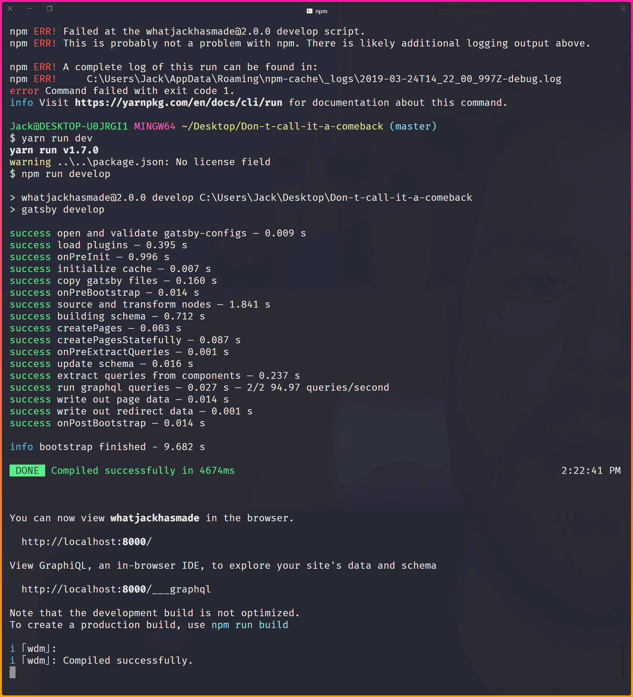

---

## Access to data via GraphQL

For most developers, querying data in WordPress is often done in the templating language itself via WordPress functions like the_title(); or get_field();

<Notes>Other developers may opt to query using SQL statements.</Notes>

---

## Access to data via GraphQL

However, with Gatsby we have access to the data in a language called GraphQL.

---

## GraphQL

To query the data Gatsby has access to, we can either pop open their friendly URL which for me is [http://localhost:8000/\_\_\_graphql](http://localhost:8000/___graphql)

---

## GraphQL

I prefer to use a tool called GraphQL Playground as it has a dark mode which helps with my vision!

---

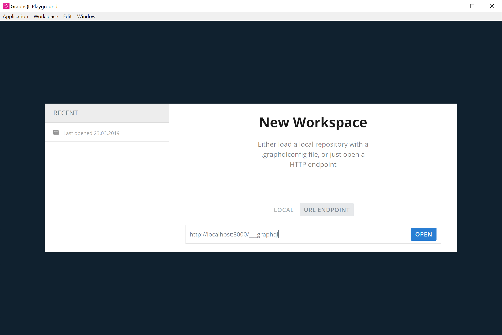

---

## My First Gatsby GraphQL Query


---

<CodeSurfer
	title="Querying Our Nodes"
	theme={shadesOfPurple}
	code={QueryGraphQL}
	lang="graphql"
/>

---

## Pages With Queries

We now have 'nodes' that are accessible as the node type of 'Page'.

We'll be using these nodes to auto generate pages based on the JSON imported from our custom endpoints.

---

<CodeSurfer
	theme={shadesOfPurple}
	title="Generating Pages With Our Gatsby Plugin"
	code={PluginWordPressGenerate}
	steps={[
		{
			notes: ""
		},
		{
			range: [1, 4],
			notes:
				"First we tap in to Gatsby's createPages function and create a GraphQL promise"
		},
		{
			range: [5, 37],
			notes:
				"Within the GraphQL promise, we create a query to expose all the data available via our Gatsby plugin"
		},
		{
			range: [5, 37],
			notes:
				"Before writing a query here, I'd highly recommend testing it at http://localhost:8000/___graphql"
		},
		{
			range: [38, 62],
			notes:
				"After the query, we are then looping over each page we find and using the createPage function"
		},
		{
			range: [38, 62],
			notes:
				"Creating the page this way, allows us to access the data as props later on"
		}
	]}
/>

---

<CodeSurfer
	theme={shadesOfPurple}
	title="Accessing the data via props"
	code={Page}
	steps={[
		{
			range: [1, 3],
			notes:
				"The page template first imports React and some components I've created to assist with generating the page"
		},
		{
			lines: [7],
			notes:
				"Here I am destructuring the 'content' property from the context we defined in the previous slide"
		},
		{
			range: [9, 13],
			notes:
				"I then return the page in a Base wrapper with my global styles and pass the content data into a block parser"
		}
	]}
/>

---

## Sanitizing and rendering components with the data

The data itself is still simply that, data.

To process the data we need to write some functions which check what type of block is available and then render the correct React component based on that.

<Notes>
	This is done with my ACFParser block, which is one of the largest files in my
	project.
</Notes>

---

<CodeSurfer
	theme={shadesOfPurple}
	title="ACFParser block"
	code={Parser}
	steps={[
		{
			range: [1, 3],
			notes:
				"The ACF Parser component first imports React and the hero component"
		},
		{
			range: [5, 7],
			notes:
				"I then create a new object which holds a key assigned to the Hero component"
		},
		{
			range: [9, 26],
			notes:
				"The CreateMarkup component imports the JSON block data and loops over each block available"
		},
		{
			range: [9, 26],
			notes: "If there's a match we return the component with the block data"
		}
	]}
/>

---

## ACFParser block

If the parser detects the name `acf/hero` which we have in our endpoint then it will import that component with all of the layout, styles and logic related to it.

---

<CodeSurfer
	theme={shadesOfPurple}
	title="Our Hero Component"
	code={Hero}
	steps={[
		{
			range: [1, 2],
			notes: "To kick things off, we import React and Styled-Components"
		},
		{
			range: [11, 13],
			notes:
				"Within the component rendering, we are then destructuring the data we passed in from ACFParser"
		},
		{
			range: [15, 24],
			notes:
				"Then we return the HeroComponent constant with the content we've passed down"
		},
		{
			range: [4, 8],
			notes:
				"Next I define a constant for the HeroComponent element, which uses the properties we've just passed in the render method"
		},
		{
			range: [4, 8],
			notes:
				"If no background data is passed, we fallback to the hex colour blue"
		}
	]}
/>

<Notes>
	The two data fields we are importing are the background colour of the hero,
	and the WYSIWYG content.
</Notes>

---


---

## Building our pages

All that is left now is to start creating content in WordPress to be digested by Gatsby.

---


---

## Things to be aware of

During development, Gatsby only has access to data imported on the time of `yarn run dev` or `npm run dev`.

If you create new pages or add content to WordPress, restart your local server.

---

## Styled Components

The hero component is a great example of how it can be used effectively.

<Notes>
Remember way back at the start of this presentation I said we were using Styled Components?

Simply changing the background colour value in WordPress means that we have updated the prop set in our component on render.

</Notes>

---

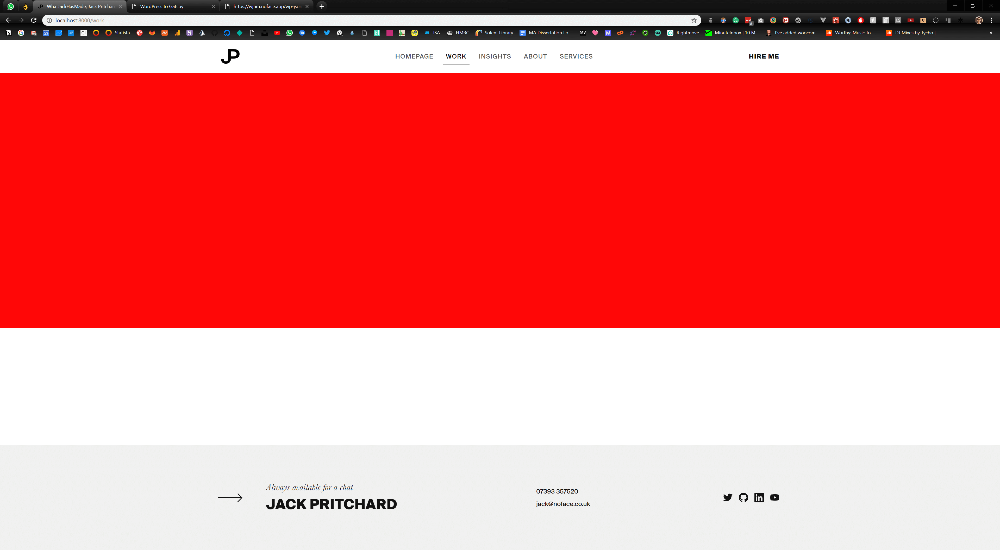

---

## Creating Future Components

1. Register block - Functions
2. Register block - Twig (Optional)
3. Register block - ACF
4. Find and Replace - Functions
5. React Component

---

## Hooking Netlify Up

So now we have a static site being generated. It's time to get this bad boy live for the world to see.

---

## Hooking Netlify Up

[https://app.netlify.com/](https://app.netlify.com/) are a great hosting solution as again it's FREE and they continously deploy on repository changes, warn you of insecure code references (HTTP vs. HTTPS).

---

## Hooking Netlify Up

---

<iframe
	width="940"
	height="540"
	src="https://www.youtube.com/embed/4IkOesUILhs"
	frameBorder="0"
	allow="accelerometer; autoplay; encrypted-media; gyroscope; picture-in-picture"
	allowFullScreen
/>

---

# 👋

## Hello World

---

## Generate on Content Changes

https://github.com/crgeary/wp-jamstack-deployments

---

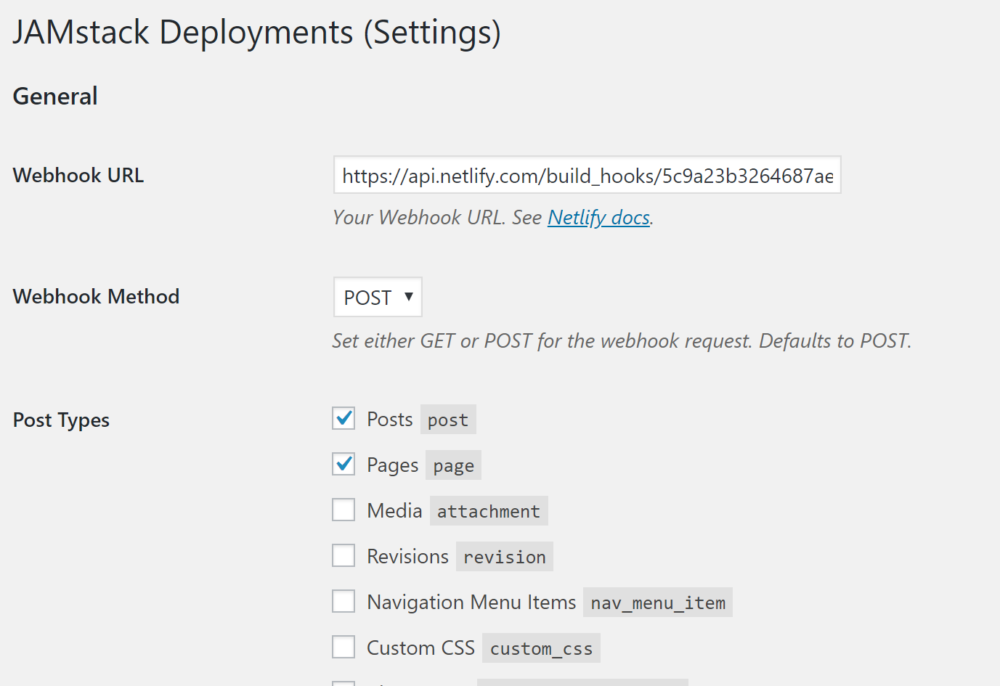

---

## That's all folks

Thanks for letting me ramble, there may be a few points I had to trim out for the sanity of your ears, so if you have questions you want to ask, then please do and I'll try my best to answer!

---

## Contact Information

- jack@noface.co.uk
- whatjackhasmade on all socials
- whatjackhasmade.co.uk
- noface.co.uk
- NoFace
