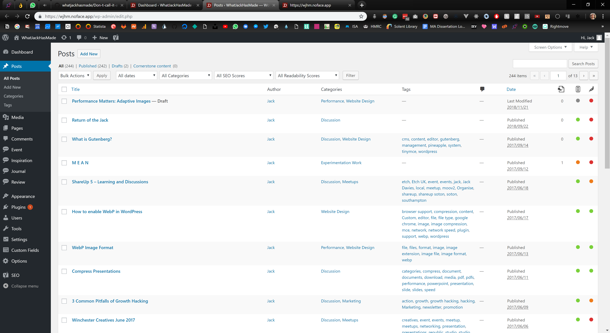
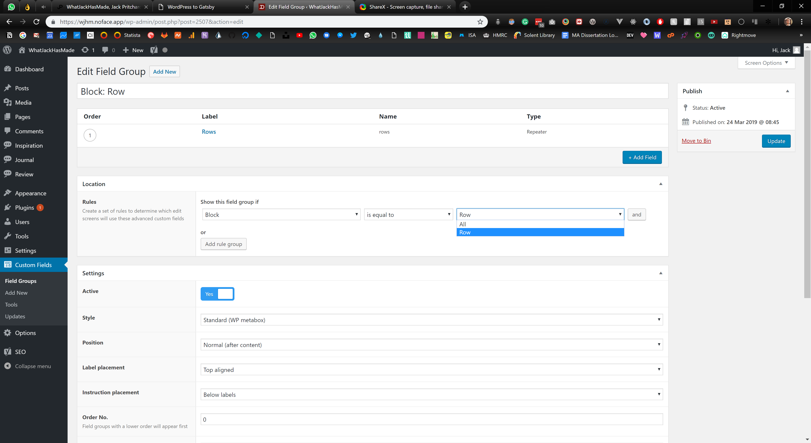
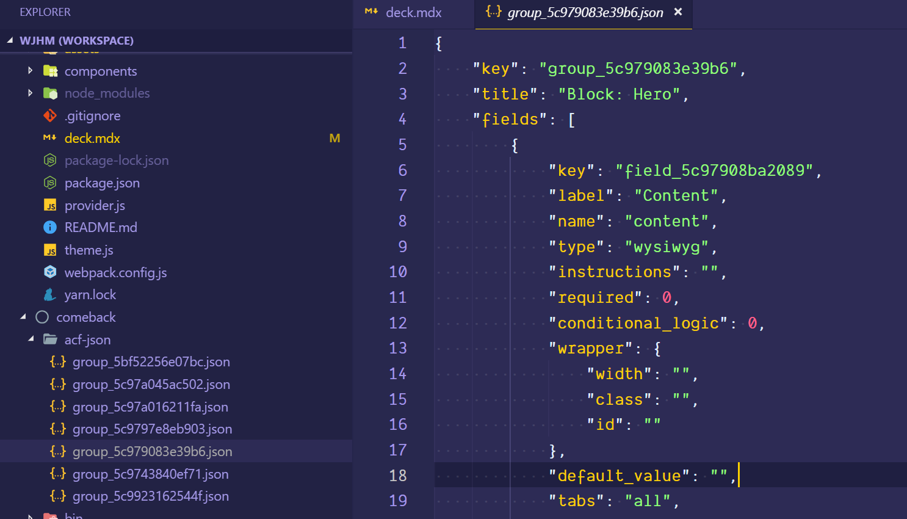
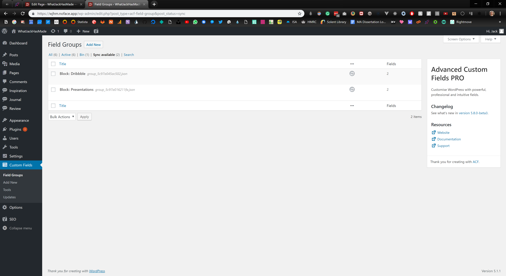
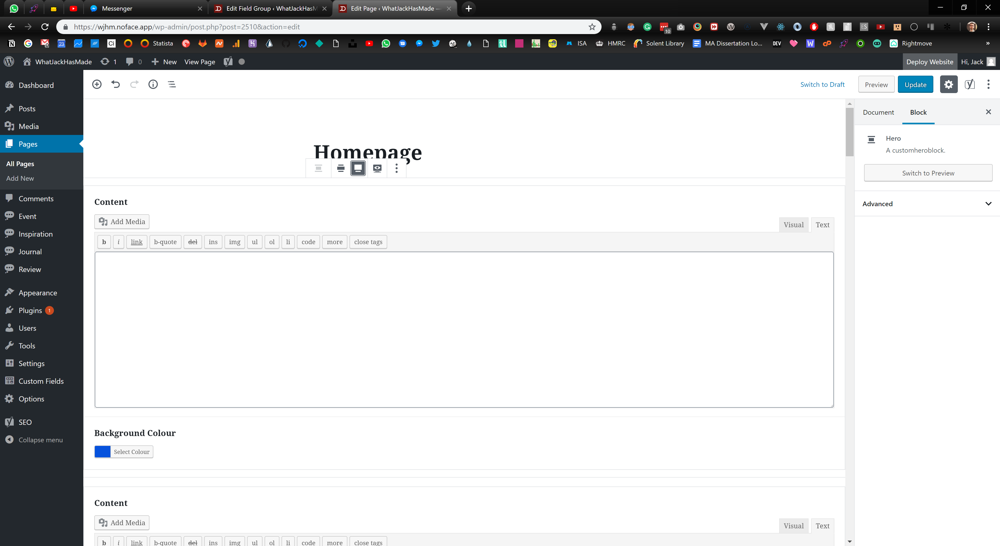
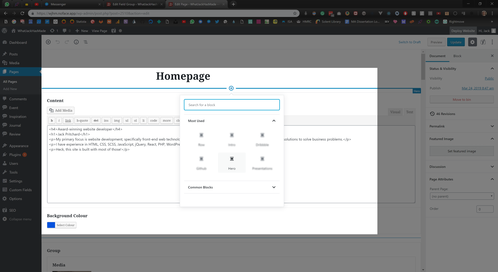
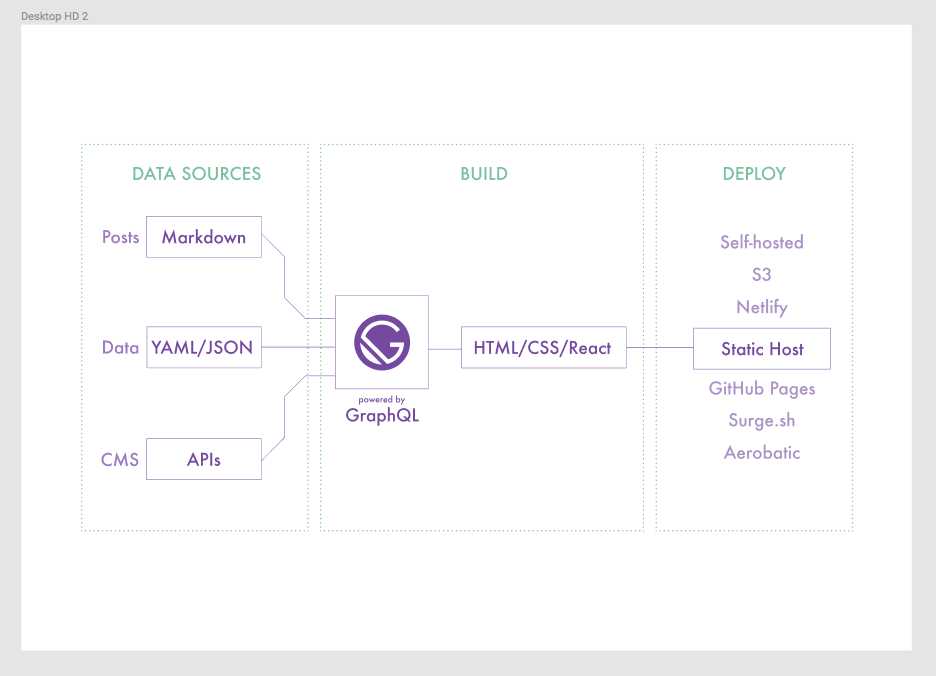
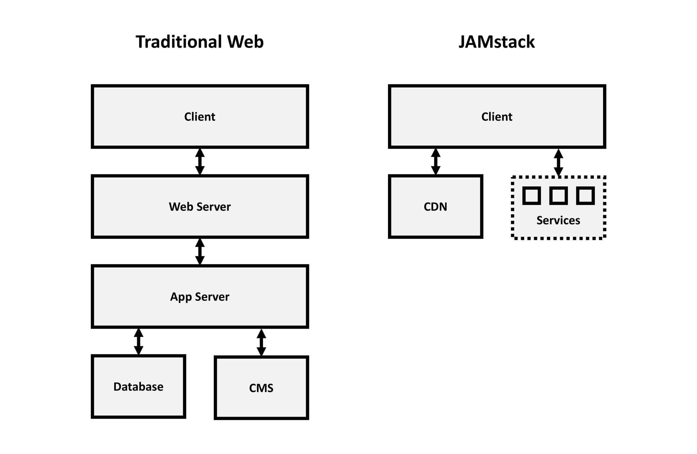
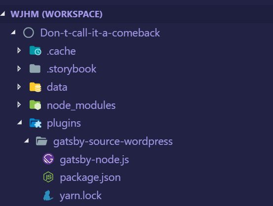
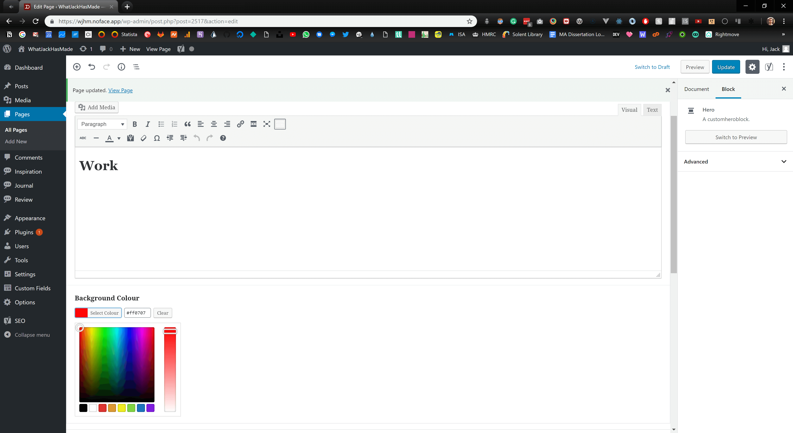

import { Image, Head, Notes } from "mdx-deck";

export { default as theme } from "./theme.js";

import { CodeSurfer } from "mdx-deck-code-surfer";

import {
	ConvertContent,
	DisableGutenberg,
	RegisterHero,
	RestAction,
	RestPosts,
	PluginWordPress,
	PluginWordPressGenerate,
	Hero,
	Page,
	Parser
} from "./components/Snippets.js";

<Head>
	<title>WordPress to Gatsby</title>
</Head>

# WordPress to Gatsby

---

## Jack Pritchard

### Freelance Fullstack Website Developer

🏄‍ Most of the time you'll find me surfing the world wide web

---

## Shameless Plug

### Taking on projects for summer 2019

I focus on front-end applications and have experience with React, NextJS, Gatsby, WordPress, Timber, and most of the related frameworks.

🚀 I have an obsession to make web products faster.

---

## Back To The Talk Jack 👀

---

## WordPress to Gatsby

This presentation is a step by step process on how I have imported my WordPress website data to one of the most popular static site generator, Gatsby.

---

## The Final Product

---

<iframe src="https://whatjackhasmade.co.uk" height="800px" width="1600px" />

---

## Before We Get Started!

### Let us Define Some of the Technologies Being Used

---

# Our Backend 🍑

---

## WordPress

I assume many of you in the room know what WordPress is.

However, for those who need a recap, WordPress is an open source CMS (Content Management System).

Super popular, and used in a large portion of all sites on the web.

<Notes>
	Some crazy figure like WordPress runs 32% of the entire internet is often
	thrown around.
</Notes>

---

## Headless WordPress

WordPress setups often involve a theme which provides front-end and back-end files to render webpages.

Instead, we are going to be creating custom API endpoints in our WordPress theme and importing that data to Gatsby to render pages.

Essentially using WordPress as only a backend.

<Notes>
	I want to make this clear distinction that whilst WordPress is great for a large portion of general client sites and handling of data.

    We are not going to be solely relying on traditional PHP or Twig files to generate our pages.

</Notes>

---

## Gutenberg

For anyone using WordPress, I assume you know what Gutenberg is.

For better or for worse.

Gutenberg is the default content editor for WordPress as of 5.0.0

<Notes>
I know it has its issues.

However, I think the block building experience is here to stay.

</Notes>

---

## Advanced Custom Fields (ACF)

ACF is a must have for any developer looking to improve their themes.

ACF allows developers to add custom fields (who'd have thought?) to posts and pages on a WordPress site.

<Notes>
	Not only this but as of ACF 5.8.0 (We are using a beta build) you can now
	attach custom fields to Gutenberg blocks.
</Notes>

---

# Our Frontend 🎨

---

## React ⚛

React is a popular javascript framework, often compared to Vue and Angular.

The concept in React is to create files as 'Components' and then import them into one another when required.

<Notes>
	The syntax is at first intimidating but you will build pages with HTML,
	JavaScript and CSS (Another hot debate).
</Notes>

---

## Styled Components

Styled Components is a node package you can import into React that will allow you to define your CSS/SCSS within a component file.

<Notes>
Essentially allowing you to keep all code related to a component in one neat file.

As well as this, any data your component has access to, you can pass into styled components to render new CSS on the fly.

</Notes>

---

## Gatsby

Gatsby is a static site generator that can generate static HTML files from data imported into the framework.

The final result is that which encompasses all of the latest and greatest available in React tooling with an old-school feel of hosting a site made up of HTML, CSS and JS files alone.

<Notes>
As Gatsby is a fresh technology, many developers are opting to search for new CMS alternatives to WordPress which are compatible with Gatsby.

Either that or they are completely rebuilding their sites in markdown files.

I'm in favour of porting existing technologies to improve client usability and reduce the cost of embracing new technologies.

</Notes>

---

## Netlify

Netlify is one of the most delightful hosting platforms available.

Even better, it's completely free to get started with hosting static sites, it'll even automatically build and deploy our site when changes are made to our repositories.

---

### Backend

- WordPress
- Headless WordPress
- Gutenberg
- ACF

### Frontend

- React
- Styled Components
- Gatsby
- Netlify

---

## Still With Me? 😅

Don't be put off!

I know we've covered a few different technologies, but this talk is a step by step process.

<Notes>
	if you have any questions throughout the talk, I'll be taking a 2-minute break
	to answer questions on the backend and then a couple of minutes in the end to
	discuss the complete walkthrough.
</Notes>

---

## Let's Go!

---

## The Task (Project)

I had set myself a task, to rebuild my personal website https://whatjackhasmade.co.uk 🔌

<Notes>
Second plug

I thought this would be a great excuse to tidy up my MVP version of my website, as well as take some time out from client requirements.

</Notes>

---

## Designs

I'm a big fan of atomic design, for anyone unfamiliar, atomic design is a concept of looking at pages and slicing them into smaller and smaller components.

<Notes>
	Brad Frost is the dad of Atomic Design so I highly recommend checking out his
	material if you want to learn more.
</Notes>

---

## Homepage

---

<Image src="assets/images/homepage.png" size="800px" />

---

## Homepage - Disected

---

<Image src="assets/images/homepage-components.jpg" size="800px" />

---

## We'll Only Be Focussing on The Hero

---

<Image src="assets/images/hero.gif" size="800px" />

---

## Development Time

So we've got our designs, now time to start Developing

---

## WordPress

All we need to know is that we are running version 5 or above.

My WordPress environment is hosted at [https://wjhm.noface.app](https://wjhm.noface.app) on a shared hosting platform with PHP available.

---

## WordPress Plugins - Minimum Requirements

The only plugin we need to follow this process is ACF 5.8.0 Beta 3.0

<Notes>
Installing Beta 4.0 introduces breaking changes to how repeater fields are displayed later on.

When ACF 5.8.0 gets an official release I'll work on tweaking the process.

</Notes>

---

## WordPress plugins - My Setup

- ACF 5.8.0 Beta 3.0
- Enhanced Media Library
- JAMstack Deployments
- Timber
- TinyPNG
- WP Migrate DB Pro
- WP Migrate DB Pro (Media Add-on)
- Yoast SEO

---

## WordPress Theme

To kickstart the WordPress theme, I've downloaded and installed the Timber Starter Theme.

Feel free to download my theme repository as a starting point and alter as you need to - [https://github.com/whatjackhasmade/WJHM-Wordpress-Theme](https://github.com/whatjackhasmade/WJHM-Wordpress-Theme)

<Notes>
	I've made a few alterations to the code but we'll dive into that in a moment.
</Notes>

---

## WordPress Theme Structure

---

<Image src="assets/images/theme-structure.png" size="500px" />

<Notes>
So far the setup is pretty standard, if you are unfamiliar with Timber, then you should in theory be able to do this without Timber.

The only alterations you will need to make is in how we register our Gutenberg blocks in a few slides.

</Notes>

---

## Removing Front-End Theme Files

To keep focus on a Headless WordPress build, I have for this project scraped all twig file templates and their components.

---

## WordPress Posts and Pages - WP Admin

---



---

## This is what we're left with

<iframe src="https://wjhm.noface.app" height="500px" width="1000px" />

---

## What we actually have

What we actually have - [https://wjhm.noface.app/wp-json/wp/v2/posts/](https://wjhm.noface.app/wp-json/wp/v2/posts/)

<Notes>
But what the heck is all of this?

These are REST API endpoints which allow for Create, Read, Update and Delete (CRUD) functions to your WordPress setup.

</Notes>

---

## WordPress REST API

Support for the WordPress REST API has been part of the project's core since version 4.7.0.

<Notes>
It opens doors as front-end frameworks are exploding in popularity.

You can now adopt WordPress to work fairly seamlessly with any of your preferred development workflows.

</Notes>

---

## Headless WordPress

So this is where the concept of headless WordPress comes into play.

We are using WordPress as a content management system only.

<Notes>
Displaying data that we can digest in whatever language we want.

As long as it accepts JSON!

</Notes>

---

## How far can you get with the existing API?

You can get pretty far in what you want to achieve with the existing API.

However, there are a few issues I have with the endpoints

---

## Issues with the existing API

### Bloated

The endpoints were built to include as many use cases as possible, as a result, it is bloated with meta information I don't need

---

## Issues with the existing API

### Limitations

You are limited to 100 results per page (I have over 200+ blogs I want to query without passing in several endpoints)

---

## Issues with the existing API

### Missing Data

I would love to get access to some ACF or Yoast SEO information from the endpoints but these are currently setup without plugins in mind

---

## Issues with the existing API

Great for setting HTML - Not for generating

---

## Creating Our Endpoints

Fortunately, you can hook into WordPress and create your own endpoints.

I've got a whole blog post about it on my company site -[https://noface.co.uk/rest-endpoint-wordpress-menus](https://noface.co.uk/rest-endpoint-wordpress-menus)

<Notes>
To save ourselves some time, I won't go into too much detail as we could literally have a whole presentation on creating endpoints.

That being said, I'll give you a quick overview.

</Notes>

---

<CodeSurfer
	title="Creating our WordPress Posts Endpoint"
	code={RestAction}
	lang="php"
	steps={[
		{
			notes: "Before we generate our API data, we need to register the endpoint"
		},
		{
			lines: [3],
			notes: "First we hook into the 'rest_api_init' hook"
		},
		{
			lines: [4, 5],
			notes:
				"Next we register the route, this will be our slug for the endpoint"
		},
		{
			lines: [6],
			notes: "As Gatsby will only be importing data, we set the method to GET"
		},
		{
			lines: [7],
			notes: "The callback function we'll be defining in the next slide"
		},
		{
			range: [8, 14],
			notes:
				"Finally, we can accept some arguments, in my own setups I will use a slug parameter for specific page/post querying"
		},
		{
			notes:
				"and there's our endpoint generated at - https://wjhm.noface.app/wp-json/posts/v2/all"
		}
	]}
/>

---

<CodeSurfer
	title="Creating our Endpoint Content"
	code={RestPosts}
	lang="php"
	steps={[
		{
			notes:
				"We're going to create the callback function we just mentioned for our rest endpoint"
		},
		{
			range: [1, 11],
			notes:
				"The function will kick off with a WP Query for all published posts"
		},
		{
			range: [11, 41],
			notes:
				"If the loop returns any results, we'll add them to an array of insights/posts"
		},
		{
			range: [41, 44],
			notes: "We'll then return the array of posts at the end of the function"
		}
	]}
/>

---

## Custom Endpoints ❤

Old Endpoint - [https://wjhm.noface.app/wp-json/wp/v2/posts/](https://wjhm.noface.app/wp-json/wp/v2/posts/)

Our Endpoint - [https://wjhm.noface.app/wp-json/posts/v2/all](https://wjhm.noface.app/wp-json/posts/v2/all)

---

## Now we have our endpoints

## Let's create some content

---

## Gutenberg - Disable Defaults

First, let's disable the defaults that Gutenberg is giving us

---

<CodeSurfer
	title="Gutenberg - Disable Defaults"
	code={DisableGutenberg}
	lang="php"
/>

<Notes>
With this code, we are essentially saying to Gutenberg, only display the blocks with these names.

Of course, the blocks haven't been created yet but this is to give you an idea of the blocks you'll need to add later.

</Notes>

---

## Revisiting Our Atomic Designs

Now before we go ahead and develop a building block, let's first pick the block we want to build and break it down.

One of my favourite components for a website is a hero component, so let's stick with that.

---

<Image src="assets/images/homepage-components.jpg" size="800px" />

---

### Atoms That Create The Hero

In the hero component we have a few parts of data that will be editable.

- Background Colour
- Subheading
- Heading
- Paragraph

<Notes>
Now the list could continue with data such as height, font-size, text colour, etc.

But I don't want all of those things to be fluid, I only want the text and background colour to be customisable on a per hero basis.

</Notes>

---

### Mapping the anatomy of the Hero

To simplify the block even further, as I am the only content editor, I am going to make the hero component require two fields.

- Background Colour (ACF - Colour Picker)
- Content (ACF - WYSIWYG)

---

## Register the block in functions.php

The current documentation can be found at - [https://www.advancedcustomfields.com/resources/acf_register_block/](https://www.advancedcustomfields.com/resources/acf_register_block/)

With Timber documentation on 'acf_register_block' found at - [https://timber.github.io/docs/guides/gutenberg/](https://timber.github.io/docs/guides/gutenberg/)

<Notes>
	Now the register block documentation is still a WIP and I expect there to be
	updates in the coming months by Elliot (ACF Founder).
</Notes>

---

<CodeSurfer
	title="Register the block in functions.php"
	code={RegisterHero}
	lang="php"
	steps={[
		{
			notes: "I'll briefly go through my register blocks function"
		},
		{
			range: [1, 4],
			notes: "First we check the function exists from ACF"
		},
		{
			range: [6, 8],
			notes:
				"I then create an array for the block names, the icons I want to display in Gutenberg in relation to the block and then merge the arrays"
		},
		{
			range: [10, 22],
			notes: "For each available block, we call the acf_register_block function"
		},
		{
			lines: [16],
			notes: "Note the render callback function"
		},
		{
			range: [24, 31],
			notes: "The callback function is then rendered on a per block basis"
		},
		{
			notes:
				"The callback function could be reduced to one flexible callback function but for now it works"
		}
	]}
/>

---

## Register the block in ACF

---



---

## Creating The Twig File

As you may have noticed when registering the hero block, we can render a .twig file with the contents of the fields.

```
<section class="hero" style="background-color: {{fields.background_colour}};">
	<div className="hero__wrapper">
		{{fields.content}}
	</div>
</section>
```

<Notes>
I HIGHLY recommend including this for a clients site, as it will give them immediate previews of what the new content will include on the final site.

Otherwise you'll get confused clients asking why Jack has asked you to make a white screen.

</Notes>

---

## Protip: acf-json folder

Quick protip, if you are an ACF Pro plugin user, creating a folder named 'acf-json' in your theme directory will save any configurations of your custom field groups to the theme.

<Notes>
	This is great when working locally and then deploying via version control.
</Notes>

---



---

## Push this to your online WordPress environment

With continous integration, my new block will be registered when I deploy.

Then I simply sync the ACF changes on the live site to grab the fields it expects.

---



---

## The Hero Component in Gutenberg

---



<Notes>
This is what we are left with, a new Hero block component.

The layout is a bit hit and miss depending on what fields you include and how many you include, but it's a great start for ACF and registering blocks!

</Notes>

---



---

## Magic 🧝‍

It's like magic

This is something to get excited about for all your WordPress projects

Even if you aren't interested in React, Gatsby or the front-end portion of this presentation.

---

## So far so good

We've registered our custom block and it renders nicely in our backend.

The only issue is that the block doesn't solve the problem I have when it comes to pages.

---

## So far so good?

The blocks are great at generating HTML in our endpoints, but I don't want that, I want to generate HTML and CSS in our React application.

I want the endpoints to act as a list of ingredients, not cook the meal.

---

## Post JSON vs. Page JSON

```
{
	"content": "<!-- wp:acf/hero {"id":"block_5c9791d20f725","data":{"field_5c97908ba2089":"\u003ch4\u003eAward-winning website developer\u003c/h4\u003e\r\n\u003ch1\u003eJack Pritchard\u003c/h1\u003e\r\n\u003cp\u003eMy primary focus is website development, specifically front-end web technologies and implementing the latest frameworks to create bespoke solutions to solve business problems.\u003c/p\u003e\r\n\u003cp\u003eI have experience in HTML, CSS, SCSS, JavaScript, jQuery, React, PHP, WordPress, Gatsby.\u003c/p\u003e\r\n\u003cp\u003eHeck, this site is built with most of those!\u003c/p\u003e","field_5c979098a208a":"#0652DD","field_5c9bc20dc99d0":"2626"},"name":"acf/hero","align":"full","mode":"edit"} /-->
}
```

<Notes>
This is fine for posts as I don't want to be creating blocks for a blog post.

But when creating pages, I want full access to the blocks properties to use them as props in React.

</Notes>

---

## Post JSON vs. Page JSON

```
{
	content: [
		{
			id: "block_5c9791d20f725",
			data: {
				content: "<h4>Award-winning website developer</h4> <h1>Jack Pritchard</h1> <p>My primary focus is website development, specifically front-end web technologies and implementing the latest frameworks to create bespoke solutions to solve business problems.</p> <p>I have experience in HTML, CSS, SCSS, JavaScript, jQuery, React, PHP, WordPress, Gatsby.</p> <p>Heck, this site is built with most of those!</p>",
				background_colour: "#0652DD",
				media: "http://local-whatjackhasmade.co.uk/wp-content/uploads/2019/03/32146178558_7371681145_o-e1553721252283.jpg"
			},
			name: "acf/hero",
			align: "full",
			mode: "edit"
		}
	]
}

```

<Notes>
This is what I'd like in an ideal world.

An array of gutenblocks and their properties.

</Notes>

---

## Confession

I'm not a PHP developer, I know how to achieve what I want, but it's not pretty with my skill level of PHP.

---

## Converting the content to JSON objects

I've created the following PHP functional files -

- get-acf-images.php
- get-acf-titles.php
- convert-the-content.php

<Notes>
	For the most part, I've forgotten how they even work and would greatly
	appreciate any pull requests to my theme repository so I can improve my
	understanding of this area in the development process.
</Notes>

---

<CodeSurfer
	title="Converting the Content to JSON objects"
	code={ConvertContent}
	lang="php"
	steps={[
		{
			notes:
				"Again, I welcome contributions but this is my string to object converter"
		},
		{
			range: [4, 11],
			notes:
				"I'm essentially find and replace searching for any comment code or absolute paths"
		},
		{
			range: [4, 11],
			notes:
				"Then I am splitting the string up using the placements of commas between the string objects"
		},
		{
			lines: [13],
			notes:
				"When we have our objects, I am then wrapping them in an array. You can think of this as an array of block components"
		},
		{
			lines: [15],
			notes:
				"Next I am converting the field ID's their respective names (Background Colour, Content, etc.)"
		},
		{
			range: [16, 19],
			notes:
				"The converting continues with replacing the original IDs in the object with the found names"
		},
		{
			lines: [21],
			notes:
				"Finally I believe I've started to make progress on converting images from their IDs to their full size URL"
		},
		{
			lines: [21],
			notes:
				"The next step to figure out is how I can return an object of the image at different crop sizes"
		}
	]}
/>

---

## Our New Content

```
{
	content: [
		{
			id: "block_5c9791d20f725",
			data: {
				content: "<h4>Award-winning website developer</h4> <h1>Jack Pritchard</h1> <p>My primary focus is website development, specifically front-end web technologies and implementing the latest frameworks to create bespoke solutions to solve business problems.</p> <p>I have experience in HTML, CSS, SCSS, JavaScript, jQuery, React, PHP, WordPress, Gatsby.</p> <p>Heck, this site is built with most of those!</p>",
				background_colour: "#0652DD",
				media: "http://local-whatjackhasmade.co.uk/wp-content/uploads/2019/03/32146178558_7371681145_o-e1553721252283.jpg"
			},
			name: "acf/hero",
			align: "full",
			mode: "edit"
		}
	]
}

```

<Notes>
	The new content is a structured JSON object with the name of the block, and
	data associated with the block (content and background_colour fields).
</Notes>

---

## WHEW - Backend Complete

---

## Time to Take 2 minutes for Questions or Heckling

<Notes>
Grab yourselves some water, have a toilet break if you want

Fire away with any questions you may have, or heckle me if you're bored of this talk

</Notes>

---

## Frontend

Right let's get into the front-end of the website.

<Notes>
	This portion of the presentation is heavily decoupled from WordPress but we
	will be revisiting previous slides when registering new components.
</Notes>

---

## React - Recap

Just to recap, the front-end will be built with Gatsby which is completely dependant on React.

<Notes>
	I won't go too much into React and how to get started, for the most part if
	you have npm or yarn on your machine, you'll be fine setting up a new gatsby
	site.
</Notes>

---

## Gatsby - Overview

As of writing this Gatsby is now in version 2 of it's release.

It's free to download and get started, and the starter documentation can be found on their site - [https://www.gatsbyjs.org/docs/quick-start/](https://www.gatsbyjs.org/docs/quick-start/)

If you want to follow along with my site example, download the repository from - [https://github.com/whatjackhasmade/Don-t-call-it-a-comeback](https://github.com/whatjackhasmade/Don-t-call-it-a-comeback)

---



---

## Gatsby vs Traditional server

---



---

## Benefits of Gatsby

- Hot reloading
- Enables an offline first approach
- No need for heavy queries
- No need for server queries
- Too much to list in one slide

---

## Gatsby Plugins

If we look again at the diagram of Gatsby's rendering process, you'll see that we have some form of data input for Gatsby to process.

---

## Gatsby Plugins

To gather the data, one of Gatsby's open source plugins can be plucked from their directory and installed via NPM and the gatsby-config.js file in our site root directory.

There are existing plugins for WordPress data, but I prefer to create my own.

---

## Creating our Gatsby WordPress plugin



---

<CodeSurfer
	title="Creating our Gatsby WordPress plugin"
	code={PluginWordPress}
	steps={[
		{
			notes: ""
		},
		{
			range: [1, 4],
			notes:
				"First I've imported a few NPM packages to help with handling any data"
		},
		{
			range: [6, 9],
			notes:
				"We kick things off with a function which Gatsby provides us for generating data, accessible via Gatsby"
		},
		{
			range: [10, 12],
			notes:
				"As a source of data, I am using my WordPress endpoint and performing a fetch request to pull down the JSON"
		},
		{
			range: [14, 30],
			notes:
				"When the data is available, we are then processing the data as 'nodes' in gatsby"
		}
	]}
/>

---

## Loading the Plugin

### gatsby-config.js

```
module.exports = {
	plugins: [
		{
			resolve: "gatsby-source-wordpress"
		}
	]
};
```

---

## Firing up our Gatsby site

To run the site, you'll need to have terminal access to the Gatsby root folder and run `yarn run dev` or `npm run dev`.

<Notes>
	Once started, Gatsby will begin preparing assets, data and any other
	configurations you've setup.
</Notes>

---

<Image src="assets/images/yarn-run-dev.png" size="700px" />

---

## Access to data via GraphQL

For most developers, querying data in WordPress is often done in the templating language itself via WordPress functions like the_title(); or get_field();

<Notes>Other developers may opt to query using SQL statements.</Notes>

---

## Access to data via GraphQL

However, with Gatsby we have access to the data in a language called GraphQL.

---

## GraphQL

To query the data Gatsby has access to, we can either pop open their friendly URL which for me is [http://localhost:8000/\_\_\_graphql](http://localhost:8000/___graphql)

---

## GraphQL

I prefer to use a tool called GraphQL Playground as it has a dark mode which helps with my vision!

---

<Image src="assets/images/graphql-playground.png" size="700px" />

---

## My First Gatsby GraphQL Query

---

<Image src="assets/images/graphql-playground-query.png" size="1200px" />

---

```

{
	allPage {
		edges {
			node {
				id
				date
				title
			}
		}
	}
}

```

---

## Pages in Gatsby

Similar to how with basic PHP setups, you can add a new page by adding a `blog.php` file and you'll then get a `/blog` path on your site.

The same can be done in Gatsby's `pages` directory.

---

## Auto-generate pages with JSON and GraphQL

We'll be skipping that and instead auto generating the pages based on the JSON available at our custom endpoints.

---

<CodeSurfer
	title="Generating Pages With Our Gatsby Plugin"
	code={PluginWordPressGenerate}
	steps={[
		{
			notes: ""
		},
		{
			range: [1, 4],
			notes:
				"First we tap in to Gatsby's createPages function and create a GraphQL promise"
		},
		{
			range: [5, 37],
			notes:
				"Within the GraphQL promise, we create a query to expose all the data available via our Gatsby plugin"
		},
		{
			range: [5, 37],
			notes:
				"Before writing a query here, I'd highly recommend testing it at http://localhost:8000/___graphql"
		},
		{
			range: [38, 62],
			notes:
				"After the query, we are then looping over each page we find and using the createPage function"
		},
		{
			range: [38, 62],
			notes:
				"Creating the page this way, allows us to access the data as props later on"
		}
	]}
/>

---

<CodeSurfer
	title="Accessing the data via props"
	code={Page}
	steps={[
		{
			range: [1, 3],
			notes:
				"The page template first imports React and some components I've created to assist with generating the page"
		},
		{
			lines: [7],
			notes:
				"Here I am destructuring the 'content' property from the context we defined in the previous slide"
		},
		{
			range: [9, 13],
			notes:
				"I then return the page in a Base wrapper with my global styles and pass the content data into a block parser"
		}
	]}
/>

---

## Sanitizing and rendering components with the data

The data itself is still simply that, data.

To process the data we need to write some functions which check what type of block is available and then render the correct React component based on that.

<Notes>
	This is done with my ACFParser block, which is one of the largest files in my
	project.
</Notes>

---

<CodeSurfer
	title="ACFParser block"
	code={Parser}
	steps={[
		{
			range: [1, 3],
			notes:
				"The ACF Parser component first imports React and the hero component"
		},
		{
			range: [7, 14],
			notes: "I then check that the data is valid and has properties to parse"
		},
		{
			range: [15, 22],
			notes:
				"If there is valid data, I then create an array of the page's components"
		},
		{
			range: [23, 36],
			notes:
				"I then loop over the array and if the block object has a name which matches a component I've created"
		},
		{
			range: [23, 36],
			notes:
				"I return the component and pass specific data to the component to use in the render method"
		}
	]}
/>

---

## ACFParser block

If the parser detects the name `acf/hero` which we have in our endpoint then it will import that component with all of the layout, styles and logic related to it.

---

<CodeSurfer
	title="Our Hero Component"
	code={Hero}
	steps={[
		{
			range: [1, 2],
			notes: "To kick things off, we import React and Styled-Components"
		},
		{
			range: [11, 13],
			notes:
				"Within the component rendering, we are then destructuring the data we passed in from ACFParser"
		},
		{
			range: [15, 24],
			notes:
				"Then we return the HeroComponent constant with the content we've passed down"
		},
		{
			range: [4, 8],
			notes:
				"Next I define a constant for the HeroComponent element, which uses the properties we've just passed in the render method"
		},
		{
			range: [4, 8],
			notes:
				"If no background data is passed, we fallback to the hex colour blue"
		}
	]}
/>

<Notes>
	The two data fields we are importing are the background colour of the hero,
	and the WYSIWYG content.
</Notes>

---


---

## Building our pages

All that is left now is to start creating content in WordPress to be digested by Gatsby.

---



---

## Things to be aware of

During development, Gatsby only has access to data imported on the time of `yarn run dev` or `npm run dev`.

If you create new pages or add content to WordPress, restart your local server.

---

## Styled Components

The hero component is a great example of how it can be used effectively.

<Notes>
Remember way back at the start of this presentation I said we were using Styled Components?

Simply changing the background colour value in WordPress means that we have updated the prop set in our component on render.

</Notes>

---

<Image src="assets/images/wordpress-create-hero-red.png" size="1200px" />

---

## Creating Future Components

1. Register block - Functions
2. Register block - Twig (Optional)
3. Register block - ACF
4. Find and Replace - Functions
5. React Component

---

## Hooking Netlify Up

So now we have a static site being generated. It's time to get this bad boy live for the world to see.

---

## Hooking Netlify Up

[https://app.netlify.com/](https://app.netlify.com/) are a great hosting solution as again it's FREE and they continously deploy on repository changes, warn you of insecure code references (HTTP vs. HTTPS).

---

## Hooking Netlify Up

---

<iframe
	width="940"
	height="540"
	src="https://www.youtube.com/embed/4IkOesUILhs"
	frameBorder="0"
	allow="accelerometer; autoplay; encrypted-media; gyroscope; picture-in-picture"
	allowFullScreen
/>

---

# 👋

## Hello World

---

## Generate on Content Changes

https://github.com/crgeary/wp-jamstack-deployments

---

<Image src="assets/images/wordpress-jam-plugin.png" size="1000px" />

---

## That's all folks

Thanks for letting me ramble, there may be a few points I had to trim out for the sanity of your ears, so if you have questions you want to ask, then please do and I'll try my best to answer!

---

## Contact Information

- jack@noface.co.uk
- whatjackhasmade on all socials
- whatjackhasmade.co.uk
- noface.co.uk
- NoFace
